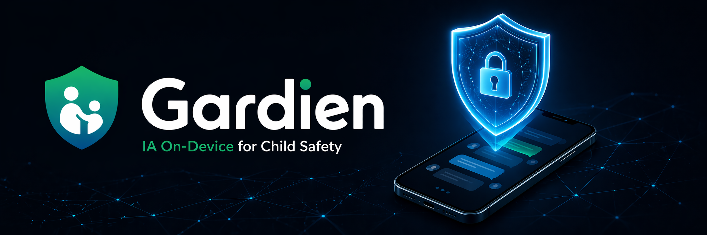

  

<h1 align="center">🛡️ Gardien</h1>
<h3 align="center">IA On-Device pour la Protection des Enfants</h3>

  
  
  
  
  

<em>Source-available · Privacy-first · On-device AI · Zero cloud dependency</em>

---

Une app Android qui protège les enfants en analysant messages et images **localement** — rien ne quitte le téléphone sauf en cas de danger.
Pas de cloud. Pas d'espionnage. Pas de tableau de bord. Juste une IA gardienne qui *comprend* le risque — et reste silencieuse jusqu'à ce qu'elle doive agir.

## 🚫 Ce que Gardien n'est PAS

- ✖️ Bark, Qustodio ou mSpy — on n'envoie pas les messages de votre enfant dans le cloud.
- ✖️ Un outil d'espionnage parental — vous ne lisez pas les messages de votre enfant.
- ✖️ Un tracker de temps d'écran — on ne surveille pas combien de temps ils passent sur leur téléphone.

## ✅ Ce que c'est

- ✅ Un LLM local sur le téléphone Android de l'enfant (Phi-3-mini 3.8B)
- ✅ Surveille toutes les apps de messagerie (WhatsApp, Snapchat, TikTok, Discord, Instagram, SMS) via Android Accessibility + Notification services
- ✅ Détecte le harcèlement, la prédation, l'automutilation, les contenus sexuels — avec Llama Guard 3 fine-tuné
- ✅ Aucune donnée ne quitte l'appareil sauf en cas d'incident
- ✅ En cas de danger : envoi d'un SMS aux parents + verrouillage du téléphone (appels uniquement aux parents autorisés)
- ✅ Génère des preuves signées cryptographiquement (SHA-256 + RFC 3161) à valeur juridique
- ✅ Conception privacy-by-design : enfant informé, consentement des deux parents requis, conforme RGPD/droit français

## 🚀 Roadmap

Phase 0: Fondations ✅ → Phase 1: Capture → Phase 2: IA → Phase 3: Alerte & Lock → Phase 4: Preuves → Phase 5: UX → Phase 6: Tests

## 📜 Licence

- Code : [AGPL-3.0 + Commons Clause](LICENSE) — Source-available, pas d'usage commercial
- Documentation : [CC BY-NC-SA 4.0](LICENSE-DOCS) — Attribution requise, non-commercial

## 📄 Documentation

- [Blueprint MVP](docs/BLUEPRINT.md)
- [Cadre juridique FR](docs/LEGAL.md)
- [Politique de sécurité](SECURITY.md)
- [Contribuer](CONTRIBUTING.md)

---

## 🇬🇧 English

> An Android app that protects children by analyzing messages and images locally — nothing leaves the phone except in case of danger.

No cloud. No spying. No dashboard. Just an AI guardian that *understands* risk — and stays silent until it must act.

### 🚫 What This Is NOT

- ✖️ Not Bark, Qustodio, or mSpy — we do not send your child's messages to the cloud.
- ✖️ Not a parental spy tool — you do not read your child's messages.
- ✖️ Not a screen time tracker — we don't monitor how long they're on their phone.

### ✅ What This IS

- ✅ A local LLM running on the child's Android phone (Phi-3-mini 3.8B)
- ✅ Monitors all messaging apps (WhatsApp, Snapchat, TikTok, Discord, Instagram, SMS) via Android Accessibility + Notification services
- ✅ Detects grooming, self-harm, violence, sexual content — using fine-tuned Llama Guard 3
- ✅ Zero data leaves the device unless an incident is detected
- ✅ In case of danger: sends SMS alert to parents + locks the phone (only calls to parents allowed)
- ✅ Generates cryptographically signed evidence (SHA-256 + RFC 3161 timestamp) for legal use
- ✅ Privacy-first design: child is informed, two-parent consent required, GDPR/FR compliant

---

> *« On protège leur vie privée, pas leur silence. »*

*Ceci est un blueprint de recherche. Pas un logiciel de production. Ne pas installer sur un appareil sans conseil juridique.*
